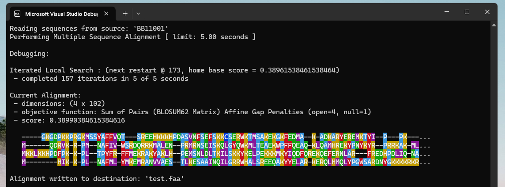
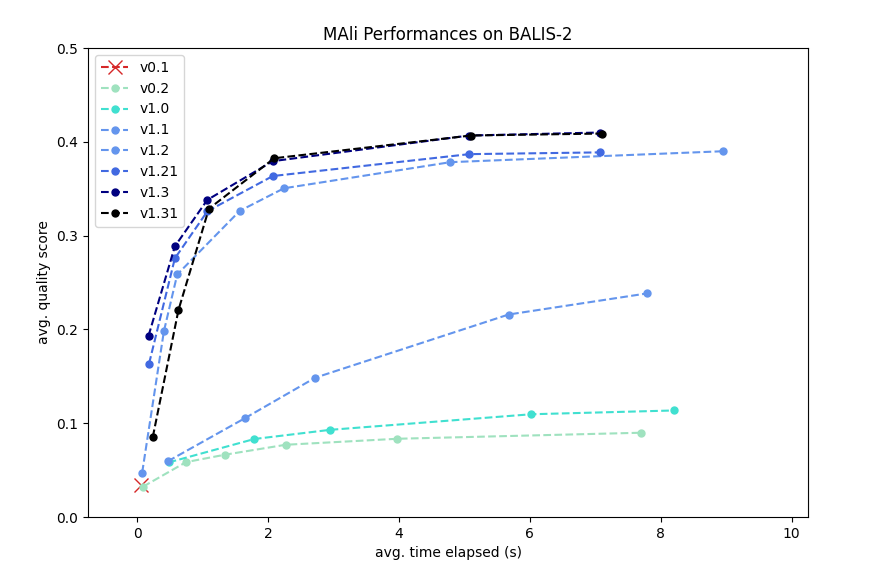

# MAli - Metaheuristic Aligner

MAli is a software tool for performing [Multiple Sequence Alignment](https://en.wikipedia.org/wiki/Multiple_sequence_alignment) iteratively.

MAli supports FASTA and CLUSTAL formats for sequence input, and outputs alignments in FASTA.

### Screenshot



### Development

| Sprint         | Date Start | Date End | Release | Additions | 
| ------------- | ------------- |------------- |------------- | ------------- |
| 1  | 30/10/24  | 12/11/24  | [```v0.1```](https://github.com/eeoooue/hons-moorhouse-p/releases/tag/v0.1)  | ```Sequence Alignment``` ```FASTA Format``` |
| 2  | 13/11/24  | 26/11/24  | [```v0.2```](https://github.com/eeoooue/hons-moorhouse-p/releases/tag/v0.2)  | ```Iterative Alignment```  ```Sum of Pairs Objective``` |
| 3  | 27/11/24  | 10/12/24  | [```v1.0```](https://github.com/eeoooue/hons-moorhouse-p/releases/tag/v1.0)  |  ```(μ, λ) Evolution Strategy``` ```Affine Gap Penalties``` |
| 4  | 11/12/24  | 14/01/25  | [```v1.1```](https://github.com/eeoooue/hons-moorhouse-p/releases/tag/v1.1)   | ```Iterated Local Search``` ```Debugging Mode``` |
| 5  | 15/01/25  | 28/01/25   | [```v1.2```](https://github.com/eeoooue/hons-moorhouse-p/releases/tag/v1.2) | ```Iterative Refinement``` ```Needleman-Wunsch Alg.``` |
| 6  | 29/01/25  | 19/02/25   | [```v1.21```](https://github.com/eeoooue/hons-moorhouse-p/releases/tag/v1.21) | ```Multi-Objective Alignment``` ```ClustalW Format``` |
| 7  | 19/02/25  | 26/02/25   | [```v1.3```](https://github.com/eeoooue/hons-moorhouse-p/releases/tag/v1.3)  | ```NSGA-II``` ```Similarity Graph``` |
| 7  | 12/03/25  | 19/02/25   | [```v1.31```](https://github.com/eeoooue/hons-moorhouse-p/releases/tag/v1.31) | ```(μ + λ) Evolution Strategy``` ```Block Splitting``` |

### Performance

The plot below shows the performance of MAli iterations in release testing. These tests were conducted using structural benchmarking on testcases from BALIS-2, a subset of BAliBASE specific to this project.



